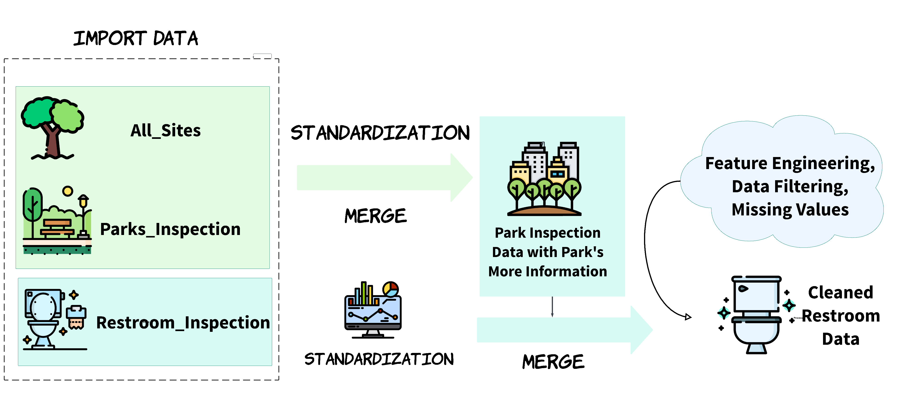

```{r setup, include=FALSE}
library(tidyverse)
library(lubridate)
library(kableExtra)
library(ggplot2)
library(ggrepel)
library(plotly)
```

## Motivation

Clean and well-maintained restrooms in public parks are more than just a convenience—they play a big role in keeping visitors healthy and happy. Research shows that the condition of restrooms can affect how people feel about using parks, influencing their overall experience and sense of comfort. Since parks are important spaces for exercise, relaxation, and connecting with others, understanding and improving sanitation is essential. By examining sanitation conditions in NYC parks, this study aims to uncover patterns, trends, and factors influencing restroom cleanliness, providing insights to improve public health and park experiences.

<div style="text-align: center;">

Image source: [Central Park Conservancy](https://www.centralparknyc.org/restrooms)
</div>

## Initial Questions

The key questions for this analysis are:

 -	What is the distribution of restroom sanitation conditions in New York City’s public parks?
 -	How do sanitation conditions vary by borough and park type?
 -	What is the trend in restroom sanitation ratings across different seasons and years (2015-2024)?

Over time, additional questions emerged:

 -	How does restroom sanitation relate to other factors like visitor count or park maintenance?
 -	Are restrooms with higher visitor counts more likely to be rated as “Very Unacceptable” (U/S)?


## Data

### Source

The data used in this analysis was obtained from the New York City Parks Inspection Program (PIP), a comprehensive, outcome-based performance measurement system. PIP generates frequent, random, and detailed inspections of parks and their facilities, focusing on cleanliness, structure, and landscape. The dataset includes ratings for up to 17 park features, each assessed under the broader categories of cleanliness, structural, and landscape conditions. For more details, visit the [Parks Inspection Program dataset website](https://data.cityofnewyork.us/browse?Data-Collection_Data-Collection=Parks%20Inspection%20Program%20(PIP)&sortBy=alpha).

The datasets we used here are [Public Restroom Inspections](https://data.cityofnewyork.us/City-Government/Parks-Inspection-Program-Public-Restroom-Inspectio/mp8v-wjtf/about_data), [Inspections](https://data.cityofnewyork.us/dataset/Parks-Inspection-Program-Inspections/yg3y-7juh/about_data) and [All Sites](https://data.cityofnewyork.us/City-Government/Parks-Inspection-Program-All-Sites-MAPPED-/buk3-3qpr/about_data) datasets.


### Data Cleaning Process

The data cleaning process involved importing three datasets (toilet_inspection, parks_inspection, and sites_inspection) and standardizing their column names using `janitor::clean_names()`. The datasets are then merged based on common identifiers `(inspection_id and prop_id)`. New features, such as the year column, are created, and unnecessary columns were removed. Data is filtered to include only public restrooms and relevant columns. Missing values in the `pr_litter` column are removed, and categorical values in `season` and `boro` are standardized. Finally, the dataset is filtered to include records from 2015 to 2024, ensuring a clean and consistent dataset for analysis.

```{r include=FALSE, message=FALSE}
toilet_insepction=read_csv(
  "data/nycparks_restroom/Parks_Inspection_Program___Public_Restroom_Inspections_20241123.csv",
  na = c(".", "NA", "")) |> 
  janitor::clean_names() 

parks_inspection=read_csv(
  "data/nycparks_restroom/Parks_Inspection_Program___Inspections_20241123.csv",
  na = c(".", "NA", "")
) |> 
  janitor::clean_names() 

sites_inspection=read_csv(
  "data/nycparks_restroom/Parks_Inspection_Program___All_Sites__MAPPED__20241123.csv",
  na = c(".", "NA", "")
) |> 
  janitor::clean_names()

inspection_merge1= parks_inspection |> 
  left_join(sites_inspection, by="prop_id")

restroom_data = toilet_insepction |> 
  left_join(inspection_merge1, by="inspection_id") |> 
  mutate(
    year = year(mdy_hms(date))
  ) |>
  rename(
    park_id=prop_num,
    park_name=prop_name) |> 
  filter(public_restroom == "Yes") |> 
  select(
    park_id, park_name, category, boro, rated, year, season, round, 
    prop_location, visitor_count, pr_litter, pr_overall_condition
  )

restroom_data = restroom_data |> 
  filter(!is.na(pr_litter)) |> 
  mutate(
    season=str_replace(season,"spring","Spring"),
    boro=str_replace(boro, "B","Brooklyn"),
    boro=str_replace(boro, "M","Manhattan"),
    boro=str_replace(boro, "Q","Queens"),
    boro=str_replace(boro, "R","Staten Island"),
    boro=str_replace(boro, "X","Bronx")
  ) |> 
  filter(year >= 2015 & year <= 2024) |> 
  select(-rated, -pr_overall_condition)
```

<div style="text-align: center;">
  
  <figcaption>Restroom Data Processing Workflow</figcaption>
</div>


**Variables and Their Meanings in Restroom Data:**

 - `park_id`: A unique identifier for the park, used to distinguish between different parks.
 
 - `park_name`: The name of the park.
 
 - `category`: The category of the park, indicating the type of park (small park or large park).
 
 - `boro`: The borough in which the park is located, representing one of New York City’s five boroughs (e.g., Brooklyn, Manhattan, etc.).
 
 - `year`: The year of the data record, representing the year the inspection data was collected.

 - `season`: The season during which the data was recorded (e.g., Spring, Summer, etc.).
 
 - `round`: The inspection round, indicating the specific inspection cycle or phase.
 
 - `prop_location`: The specific location or address of the park.
 
 - `visitor_count`: The number of visitors to the park, representing the number of park visitors during a certain period.

 - `pr_litter`: The litter condition rating for the public restrooms, indicating the cleanliness and trash situation in the restrooms.
 
The first three lines of the data content are shown as follows.

```{r message=FALSE,warning=FALSE}
kable(head(restroom_data,3))  |> 
  kable_styling(full_width = FALSE)
```

## Exploratory Analysis

### 1. Distribution of Restroom Sanitation Conditions

To understand the distribution of restroom sanitation conditions, we calculated the percentage of each sanitation category in the dataset. The pr_litter variable contains four categories: Acceptable (A), Unacceptable (U), Not Rated (N), and Very Unacceptable (U/S).

```{r 10 percent plot}
condition_dist = restroom_data |> 
  count(pr_litter)  |> 
  mutate(
    percentage = n / sum(n) * 100,
    pr_litter_label = case_when( 
      pr_litter == "A" ~ "A = Acceptable",
      pr_litter == "U" ~ "U = Unacceptable",
      pr_litter == "N" ~ "N = Not Rated",
      pr_litter == "U/S" ~ "U/S = Very Unacceptable",
      TRUE ~ pr_litter
    )
  )

plot_ly(
  condition_dist,
  labels = ~pr_litter_label,  
  values = ~percentage,
  type = 'pie',
  textinfo = 'percent',  
  hoverinfo = 'label+percent+value',  
  marker = list(colors = c("A" = "#66c2a5", "U" = "#fc8d62", "N" = "#8da0cb", "U/S" = "#e34a33"),
                line = list(color = 'white', width = 2)))  |> 
  layout(
    title = "Distribution of Restroom Sanitation Conditions",
    legend = list(
      title = list(text = "<b>Condition</b>"),  
      x = 1,  
      y = 0.5,  
      xanchor = "left", 
      yanchor = "middle",  
      bgcolor = "rgba(255,255,255,0.5)",  
      bordercolor = "black",  
      borderwidth = 1
    ),
    margin = list(t = 50, b = 50)
  )
```

It can be seen that the majority of restrooms, **78.7%**, are rated as "Acceptable (A)," indicating generally good sanitation standards. However, **18.9%** of restrooms fall under "Not Rated (N)," suggesting a significant portion of missing or incomplete evaluations. A small percentage of restrooms are classified as "Unacceptable (U)" (**1.37%**) or "Very Unacceptable (U/S)" (**1.06%**), highlighting that severe sanitation issues are rare.

### 2. Restroom Sanitation Conditions by Borough and Park Type

**Sanitation Conditions by Borough:**

We analyzed restroom sanitation conditions across different boroughs in New York City. The bar plot below shows the percentage of each sanitation condition (Acceptable, Unacceptable, Not Rated, and Very Unacceptable) for each borough. Each bar represents a borough, and the heights of the segments within each bar represent the percentage of each sanitation condition.

```{r}
sanitation_by_borough = restroom_data  |> 
  group_by(boro, pr_litter)  |> 
  count()  |> 
  group_by(boro)  |> 
  mutate(percentage = n / sum(n) * 100)

ggplot(sanitation_by_borough, aes(x = pr_litter, y = percentage, fill = pr_litter)) +
  geom_bar(stat = "identity", position = "stack") +
  facet_wrap(~ boro, scales = "fixed") +  
  scale_fill_manual(
    name = "Sanitation Condition",  
    values = c(
      "A" = "#66c2a5",  
      "U" = "#fc8d62", 
      "N" = "#8da0cb",  
      "U/S" = "#e34a33"
    ),
    labels = c("Acceptable", "Unacceptable", "Not Rated", "Very Unacceptable")
  ) +
  labs(
    title = "Sanitation Conditions by Borough",
    x = "Sanitation Condition",
    y = "Percentage"
  ) +
  geom_text(
    aes(label = paste0(round(percentage, 1), "%")),
    position = position_stack(vjust = 1.1),
    size = 2,
    color = "black"
  ) +  
  theme_minimal() +
  theme(legend.title = element_text(size = 10), legend.position = "bottom")
```

The analysis of restroom sanitation across NYC boroughs shows the Bronx leading with the highest percentage of "Acceptable" ratings (**84.3%**), followed by Queens (**80.8%**), Staten Island (**79.3%**), Manhattan (**75.8%**), and Brooklyn (**74.8%**). "Unacceptable" and "Very Unacceptable" ratings remain below **2%** in all boroughs, with Staten Island and Queens reporting the fewest severe issues.


**Sanitation Conditions by Park Type:**

Next, we examined how sanitation conditions vary by park type (category). The following bar plot shows the sanitation conditions for each type of park.

```{r}
sanitation_by_park_type = restroom_data  |> 
  group_by(category, pr_litter)  |> 
  count()  |> 
  group_by(category)  |> 
  mutate(percentage = n / sum(n) * 100)

ggplot(sanitation_by_park_type, aes(x = pr_litter, y = percentage, fill = pr_litter)) +
  geom_bar(stat = "identity", position = "stack") +
  facet_wrap(~ category, scales = "fixed") +
  scale_fill_manual(
    name = "Sanitation Condition",  
    values = c(
      "A" = "#66c2a5", 
      "U" = "#fc8d62", 
      "N" = "#8da0cb",  
      "U/S" = "#e34a33" 
    ),
    labels = c("Acceptable", "Unacceptable", "Not Rated", "Very Unacceptable")
  ) +
  labs(title = "Sanitation Conditions by Park Type", x = "Sanitation Condition", y = "Percentage") +
  geom_text(aes(label = paste0(round(percentage, 1), "%")), position = position_stack(vjust = 1.1), size = 3, color = "black") +  
  theme_minimal() +
  theme(legend.title = element_blank())
```

For both Large Parks and Small Parks, the majority of restrooms are rated as "Acceptable," with 79.1% and 78.5%, respectively. However, "Not Rated" restrooms account for a slightly higher percentage in Small Parks (19.2%) compared to Large Parks (18%), indicating a minor gap in data collection for smaller facilities.

The "Unacceptable" and "Very Unacceptable" ratings are consistently low across both categories, with percentages under 2% in all cases. Small Parks have slightly fewer "Very Unacceptable" restrooms (0.9%) compared to Large Parks (1.4%), while "Unacceptable" ratings are nearly equal (1.3% vs. 1.5%).

In summary, sanitation conditions are generally good across boroughs and park types, with the Bronx and Large Parks showing slightly better conditions and fewer missing ratings.

### 3. Trends in Restroom Sanitation Ratings by Season-Year

To explore the impact of seasonal factors on restroom cleanliness, we first analyzed the cleanliness ratings (pr_litter) for restrooms in the dataset from 2015 to 2024. The cleanliness ratings were classified into four categories: Acceptable (A), Unacceptable (U), Not Rated (N), and Very Unacceptable (U/S). We wanted to understand how these ratings varied across different seasons each year.

```{r}
seasonal_cleanliness = restroom_data |> 
  mutate(
    season_year = paste(season, year),
    season_year = factor(season_year, levels = unique(season_year)) 
  ) |> 
  group_by(season_year, pr_litter) |> 
  count() |> 
  group_by(season_year) |> 
  mutate(percentage = n / sum(n) * 100)

plot_ly(
  data = seasonal_cleanliness,
  x = ~season_year,  
  y = ~percentage,  
  color = ~pr_litter,  
  type = 'scatter', 
  mode = 'lines+markers',  
  text = ~paste0(
    "Season-Year: ", season_year, 
    "<br>Condition: ", pr_litter, 
    "<br>Percentage: ", round(percentage, 1), "%<br>Count: ", n
  ),
  hoverinfo = "text", 
  marker = list(size = 6),  
  line = list(width = 2)
)  |> 
  layout(
    title = "<b>Trends in Restroom Cleanliness Ratings by Season-Year (2015-2024)</b>",
    xaxis = list(
      title = "Season-Year",
      type = "category",  
      tickangle = 90,  
      tickfont = list(size = 10)  
    ),
    yaxis = list(
      title = "Percentage",
      range = c(0, 100),  
      tickformat = ".0f"
    ),
    legend = list(
      title = list(text = "<b>Sanitation Condition</b>"),
      x = 1, y = 0.5, xanchor = "left", bgcolor = "rgba(255,255,255,0.5)"
    ),
    margin = list(t = 60, b = 100),  
    showlegend = TRUE
  )
```

The plot reveals that restroom cleanliness ratings are generally higher in summer and fall, with “Acceptable (A)” ratings consistently reaching 80%-90% and showing minimal fluctuations. This trend may result from higher maintenance frequency during peak outdoor activity seasons and favorable weather conditions. In contrast, winter ratings tend to be lower, with A ratings dropping to 75%-80% and “Needs Improvement (N)” ratings increasing, likely due to challenges in maintenance caused by cold weather and lower usage. Spring ratings fall between those of summer and winter, potentially reflecting the lingering effects of winter maintenance delays but gradually improving with warmer weather. 

Overall, summer and fall demonstrate the most stable and high sanitation ratings, while winter requires more attention to sustain restroom cleanliness.

### 4. How Visitor Count Relates to Restroom Sanitation Ratings

In this analysis, we explored the relationship between restroom sanitation conditions and visitor counts by examining the distribution of visitor counts for each sanitation rating.

```{r}
visitor_count_cleaned = restroom_data |>
  filter(visitor_count >= 0) |>  
  group_by(pr_litter) |> 
  filter(!pr_litter %in% c("N")) |> 
  mutate(
    IQR_visitor_count = IQR(visitor_count, na.rm = TRUE),
    lower_bound = quantile(visitor_count, 0.25, na.rm = TRUE) - 1.5 * IQR_visitor_count,
    upper_bound = quantile(visitor_count, 0.75, na.rm = TRUE) + 1.5 * IQR_visitor_count
  ) |>
  filter(visitor_count >= lower_bound & visitor_count <= upper_bound)

plot_ly(
  data = visitor_count_cleaned,         
  x = ~pr_litter,                       
  y = ~visitor_count,                    
  type = 'box',                         
  color = ~pr_litter,                   
  boxmean = TRUE,                        
  text = ~paste0(
    "Condition: ", pr_litter,
    "<br>Visitor Count: ", visitor_count
  ),
  hoverinfo = "text"                    
)  |> 
  layout(
    title = "<b>Distribution of Visitor Count by Restroom Sanitation Rating</b>", 
    xaxis = list(title = "Sanitation Condition"),
    yaxis = list(title = "Visitor Count"),
    showlegend = FALSE                  
  )
```

There is a strong relationship between visitor count and restroom sanitation ratings. Restrooms with higher visitor counts are significantly more likely to receive lower ratings, such as “U/S” (very unacceptable). This highlights the importance of prioritizing maintenance efforts in high-traffic areas to improve overall sanitation conditions.

## Discussion

The analysis of restroom sanitation conditions in NYC public parks revealed several trends:

 -	Boroughs like Brooklyn and Manhattan show higher rates of “Unacceptable” conditions.
 -	Sanitation tends to worsen in parks with more visitors, particularly in spring and summer.
 -	Overall, while most parks report acceptable conditions, there remains a significant portion rated as “Very Unacceptable” or “Unacceptable.”
