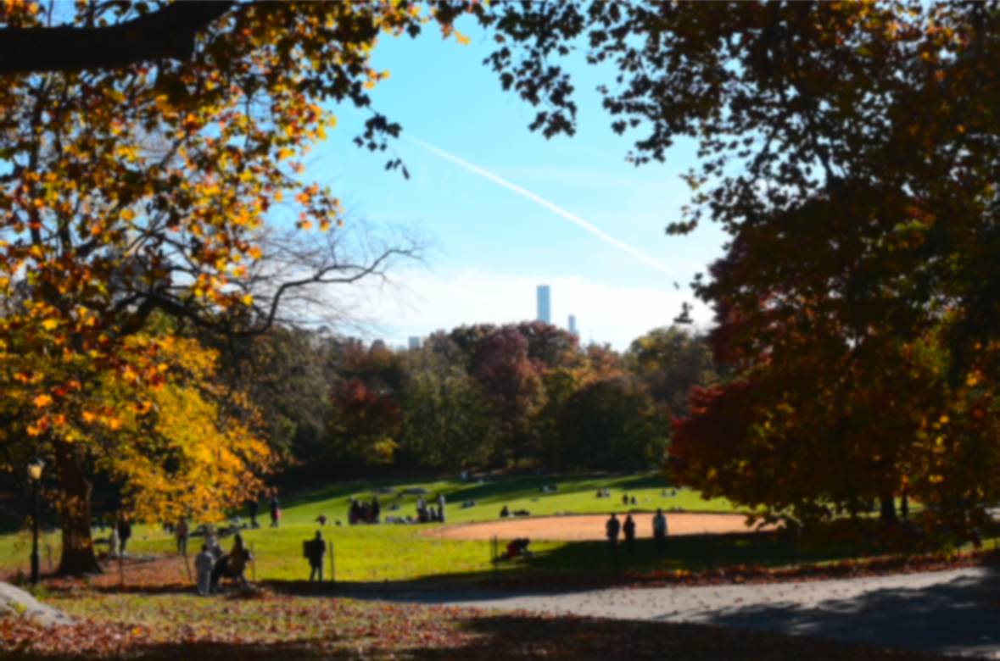

```{css, echo=FALSE}
<style>
#home-container {
  text-align: center;
  padding: 20px;
  background-color: #001f3f;
  color: white;
}

/* Styling for the welcome section */
.welcome {
  font-family: 'Arial', sans-serif;  /* Change the font family */
  font-size: 20px;  /* Increase font size */
  line-height: 1.5;  /* Adjust line spacing */
  margin-top: 20px;  /* Add space between the image and the welcome section */
}

#home-container .image-container {
  position: relative;
  display: inline-block;
  width: 100%;
}

#home-container img {
  width: 100%;
  height: 400px; /* Set a fixed height to make the image longer */
  object-fit: cover;
}

#home-container .image-container .image-title {
  position: absolute;
  bottom: 100px;  /* Position at the bottom of the image */
  right: 20px;
  font-size: 40px;
  color: white;  /* Set the title color to white */
  font-weight: bold;
}

#home-container .image-container .sub-title {
  position: absolute;
  bottom: 50px;  /* Adjusted to be a bit higher than the title */
  right: 20px;
  font-size: 24px;
  color: white;  /* Set the subtitle color to white */
}

#home-container .image-container .authors {
  position: absolute;
  bottom: 10px;  /* Adjusted to be a bit higher than the subtitle */
  right: 20px;
  font-size: 18px;
  color: white;  /* Set the authors color to white */
}
</style>

<div id="home-container">
  <div class="image-container">
    
    <!-- Title text -->
    <div class="image-title">Behind the Green</div>
    <!-- Subtitle text -->
    <div class="sub-title">Data Insights Into NYC Parks’ Cleanliness and Safety</div>
    <!-- Authors -->
    <div class="authors">Yining Cao, Maggie Hsu, Fengwei Lei, Xueting Li, Liqi Zhou</div>
  </div>
</div>
```
<p class="welcome">

### Welcome to Our Website!

Our project studies on various aspects that contribute to the overall experience of park visitors, including sanitation, cleanliness, and safety. We focus on four critical areas: crime, cleanliness, restroom, and syringe. Through our analysis, we hope to provide a holistic understanding of NYC parks, helping to guide future improvements and ensure that these public spaces remain clean, safe, and inviting for all.
</p>

### On Our Websit, You Can See:

 - **About**: The [report content](https://mh4588.github.io/p8105_final_project/report.html) and [our team](https://mh4588.github.io/p8105_final_project/about_team.html) introduction.
 - [Data](https://mh4588.github.io/p8105_final_project/data.html): What data we used in our report analysis.
 - [Crime](https://mh4588.github.io/p8105_final_project/crime.html): The safety condition in NYC parks.
 - **Sanitation**: The [overall cleanliness for NYC parks](https://mh4588.github.io/p8105_final_project/cleanliness.html), [the restroom sanitation conditions](https://mh4588.github.io/p8105_final_project/restroom.html) and [the issue of syringe litter](https://mh4588.github.io/p8105_final_project/syringe.html) in parks.
  - **Facility Maps**:
  


### Screencast
