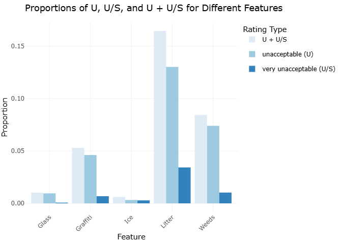

```{css echo = FALSE}
.center {
  width: 75%;
  display: block;
  margin-left: auto;
  margin-right: auto;
}

.column3 {
  float: left;
  width: 33.33%;
  padding: 5px;
}

.column2 {
  float: left;
  width: 50%;
  padding: 5px;
}

.column2, .column3 p{
  text-align: center;
  font-weight: bold;
  text-decoration: underline;
}

/* Clear floats after image containers */
.row::after {
  content: "";
  clear: both;
  display: table;
}
```

## Motivation

Public parks play a vital role in urban life, offering spaces for recreation, relaxation, and community engagement. However, their value can be compromised by issues like crime, inadequate cleanliness, and poor sanitation. Our project, _Behind the Green: Data Insights Into NYC Parks’ Cleanliness and Safety_, aims to analyze key factors affecting park visitors’ experiences, including crime rates, restroom conditions, cleanliness, and syringe litter. By uncovering insights through data analysis, we hope to guide improvements and ensure NYC parks remain safe, clean, and welcoming for all.

## Related Work

For the crime in NYC parks, 

About the sanitation aspect, we firstly analyze the [cleanliness of NYC parks](cleanliness.html), identifying specific features contributing to lower cleanliness scores, as well as examining temporal and spatial variations. This allows us to pinpoint key factors behind the fluctuations in cleanliness levels and formulate strategies for improvements. Second, understanding and improving the condition of restrooms is crucial as clean [restrooms](restroom.html) play a significant role in promoting public health and comfort, encouraging greater park use. Lastly, the critical issue of [syringe litter](syringe.html), which poses serious health and safety concerns, especially in public areas where children and families gather, demands systematic investigation. Our study aims to gather insights into the extent of this issue to support informed, data-driven decision-making and interventions.

## Initial Questions

- [**Crime**](crime.html):
- [**Cleanliness**](cleanliness.html): What are the cleanliness ratings by different features? How do cleanliness ratings vary over different time periods? What is the relationship between cleanliness and park categories?  
- [**Restroom**](restroom.html): What is the distribution of restroom sanitation conditions in New York City’s public parks? How do sanitation conditions vary by borough and park type? What is the trend in restroom sanitation ratings across different seasons and years (2015-2024)?  
- [**Syringe**](syringe.html): How does syringe litter differ between parks? How does utilization of safe disposal kiosks change over time? How does utilization of safe disposal kiosks compare with syringe litter?

## Data
**Data Source**  

- [**Crime**](crime.html):
- [**Cleanliness**](cleanliness.html): The Cleanliness data comes from the Parks Inspection Program (PIP), which evaluates New York City parks through regular inspections. PIP assesses the cleanliness of parks across 17 features, categorized under cleanliness, structural, and landscape conditions. Each feature is rated either as "Acceptable" (A) or "Unacceptable" (U), providing insight into the cleanliness conditions across different locations and features. Datasets on properties and cleanliness are maintained in this part.  
- [**Restroom**](restroom.html): Restroom data is also gathered through PIP and records detailed information about public restroom inspections in New York City parks. These inspections rate the restroom facilities for cleanliness and structural quality, contributing to the overall evaluation of park facilities. This dataset allows for the analysis of restroom conditions across different parks and helps to identify potential areas for improvement.  
- [**Syringe**](syringe.html): The Syringe dataset records syringe collection in NYC Parks, gathered by NYC Parks staff and various organizations under the Syringe Litter Data Collection initiative. The data highlights syringe disposal patterns and is accessible via NYC OpenData. The syringe collection data provides valuable insights into the safety and public health conditions of NYC Parks and is compiled monthly after thorough quality checks.  

**Data Cleaning**  

- [**Crime**](crime.html):
- [**Cleanliness**](cleanliness.html): Initially, multiple datasets were loaded and cleaned to ensure consistent column names. Relevant cleanliness features, including Litter, Glass, Graffiti, Weeds, and Ice, were selected for focused analysis. The datasets were then merged based on `prop_id` and `inspection_id` to create a comprehensive dataset encompassing park information, feature ratings, and cleanliness inspection data. Finally, the combined dataset was further cleaned and standardized by addressing missing values, removing unnecessary columns, and formatting string values to maintain data consistency.  
- [**Restroom**](restroom.html): The data cleaning process involved importing three datasets (toilet_inspection, parks_inspection, and sites_inspection) and standardizing their column names using `janitor::clean_names()`. The datasets are then merged based on common identifiers (`inspection_id` and `prop_id`). New features, such as the year column, are created, and unnecessary columns were removed. Data is filtered to include only public restrooms and relevant columns. Missing values in the `pr_litter` column are removed, and categorical values in `season` and `boro` are standardized. Finally, the dataset is filtered to include records from 2015 to 2024, ensuring a clean and consistent dataset for analysis.  
- [**Syringe**](syringe.html): The dataset on syringe findings in NYC parks was processed through several key cleaning steps. First, we standardized the date-time information by converting the collected_date field to a consistent format and extracting the year component. We also standardized the month names using the abbreviated format. Missing values in syringe counts (`ground_syringes`, `kiosk_syringes`, `total_syringes`) and kiosk_numbers were replaced with zeros to ensure consistent numerical analysis. Duplicate entries were removed using distinct(), and records with invalid location values (where location = “0”) were filtered out. Especially, we updated `kiosk_site` to TRUE where `kiosk_syringes` > 0, this ensures locations with recorded kiosk usage are properly flagged.  


## Exploratory Analysis

### 1. Cime in NYC Parks


### 2. Sanitation Conditions of NYC Parks

#### 2.1 Overall Cleanliness

**The proportions of three rating types for different features**  

From the bar chart below, we can observe the proportions of three rating types — Unacceptable (U), Very Unacceptable (U/S), and their combined proportion (U + U/S) — for different features (Glass, Graffiti, Ice, Litter, and Weeds).



- For all features, the proportion of "U/S" is relatively low compared to the "U" rating, suggesting that while some features may have been rated very unacceptable, the majority of issues fall into the unacceptable category without additional safety concerns.  
- `Litter`: The feature "Litter" has the highest combined (U + U/S) and individual "U" proportions compared to all other features. This indicates that litter is the most problematic feature in terms of cleanliness, frequently being rated as unacceptable.  
- `Weeds`: Weeds have relatively high values for both "U" and "U + U/S" proportions. This suggests that weeds are also a significant cleanliness issue.  
- `Graffiti`: Graffiti shows a moderate level of unacceptable ratings (both "U" and "U + U/S"), indicating that it is frequently, but not as consistently as Litter, rated as problematic.  
- `Glass` and `Ice`: Both features have relatively low proportions across all rating types, suggesting that these features are generally well-maintained and less frequently rated as unacceptable.  

**The least error-prone feature in different boroughs**


The table shows the feature in each borough with the highest proportion of "A" cleanliness ratings, indicating which features are the least error-prone in terms of cleanliness for each borough. The data includes results for five boroughs: Brooklyn (B), Manhattan (M), Queens (Q), Staten Island (R), and Bronx (X).

Ice is the best-maintained feature in Brooklyn, Manhattan, Queens, and Bronx, with "A" rating proportions ranging from 97.91% to 98.85%. This indicates consistent cleanliness management across these boroughs. In Staten Island, Glass has the highest "A" rating at 98.87%, suggesting a different focus in cleanliness efforts. Overall, Ice appears to be easier to maintain across multiple boroughs, while Glass is notably well-managed in Staten Island.  

**The cleanliness ratings of NYC and its boroughs during the decade**

#### 2.2 Restroom Sanitation

**Distribution of Restroom Sanitation Conditions**

We analyzed the distribution of restroom sanitation ratings, with categories “Acceptable (A),” “Unacceptable (U),” “Not Rated (N),” and “Very Unacceptable (U/S).” 


The majority (78.7%) of restrooms are rated as “Acceptable,” while 18.9% remain “Not Rated.” Only small percentages are classified as “Unacceptable” (1.37%) or “Very Unacceptable” (1.06%).

**Restroom Sanitation by Borough and Park Type**

Next, we examined how sanitation conditions vary by borough and park type (category).

```{=html}
<div class="row">
  <div class="column2">
    
  </div>
  <div class="column2">
    
  </div>
</div>
```

By borough, the Bronx has the highest percentage of “Acceptable” restrooms (84.3%), followed by Queens (80.8%). Other boroughs report similar low percentages for “Unacceptable” and “Very Unacceptable.” By park type, Restrooms in both large and small parks are mostly rated as “Acceptable” (79.1% and 78.5%, respectively). Small parks have slightly higher “Not Rated” percentages (19.2%) compared to large parks (18%), but “Unacceptable” and “Very Unacceptable” ratings are consistently low across both types.

**Trends in Restroom Sanitation Ratings by Season-Year**


Seasonal trends show that restroom sanitation is generally better in summer and fall, with “Acceptable” ratings reaching 80%-90%. Winter sees a drop to 75%-80%, possibly due to weather-related maintenance challenges, while spring ratings improve as weather warms.

**Visitor Count and Restroom Sanitation**

We examined the relationship between restroom sanitation and visitor counts.


Restrooms with higher visitor counts are more likely to have lower ratings, especially “Very Unacceptable” conditions, emphasizing the need for focused maintenance in high-traffic areas.


#### 2.3 Syringe Litter Issue


## Discussion

The analysis of NYC parks reveals several critical insights. 

For [**Crime**](crime.html) in NYC parks,

Regarding [**Cleanliness**](cleanliness.html), certain features, seasons, and boroughs were identified as factors that influence cleanliness levels. Features such as graffiti and litter consistently showed lower cleanliness scores, with cleanliness ratings varying seasonally, generally better in winter. Borough-level differences indicate the need for targeted interventions in areas lagging behind. These results align with our expectations and emphasize the importance of feature-specific solutions and seasonal adjustments.

For [**Restroom**](restroom.html) conditions, the findings show a disparity across boroughs, with Brooklyn and Manhattan often reporting higher rates of unacceptable conditions. The data also suggest that higher visitor counts, particularly during spring and summer, lead to a decline in sanitation. Although many restrooms maintain acceptable conditions, a notable number still fall under "Unacceptable" or "Very Unacceptable" categories, highlighting areas that require improvement.

In terms of [**Syringe**](syringe.html) litter, the analysis points out that traditional parks are the primary locations for syringe findings, significantly outnumbering other property types like Greenstreets and Playgrounds. The Bronx and Manhattan have the highest number of affected locations, and the peak findings during summer suggest seasonal trends that need attention. Regression analysis reveals the need for revising harm reduction strategies, focusing on more effective interventions in high-risk areas, particularly given the reduced utilization of kiosks and increasing ground findings. Addressing these issues requires further research into environmental factors and targeted policy adjustments.
