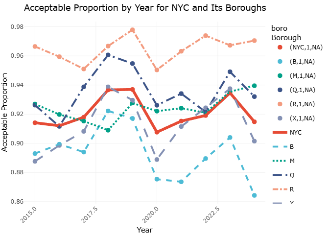
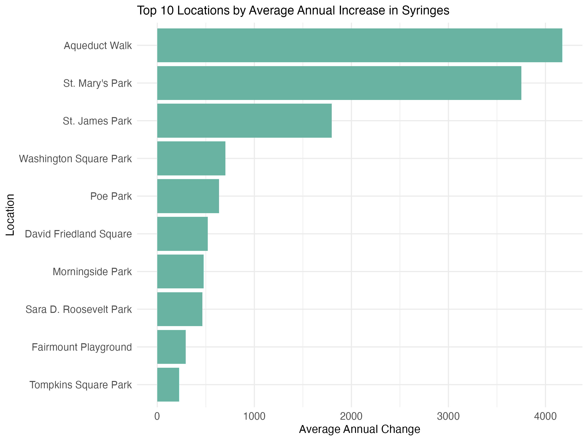
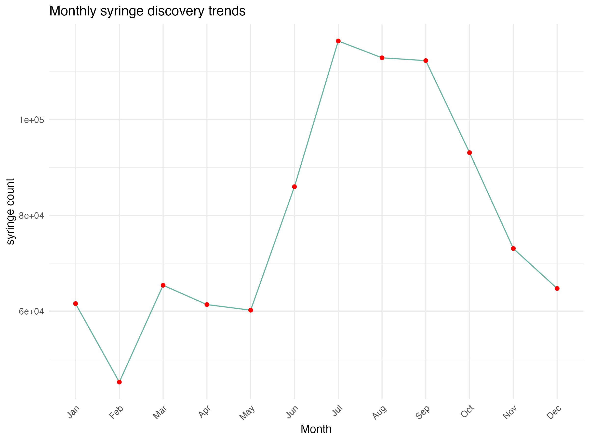
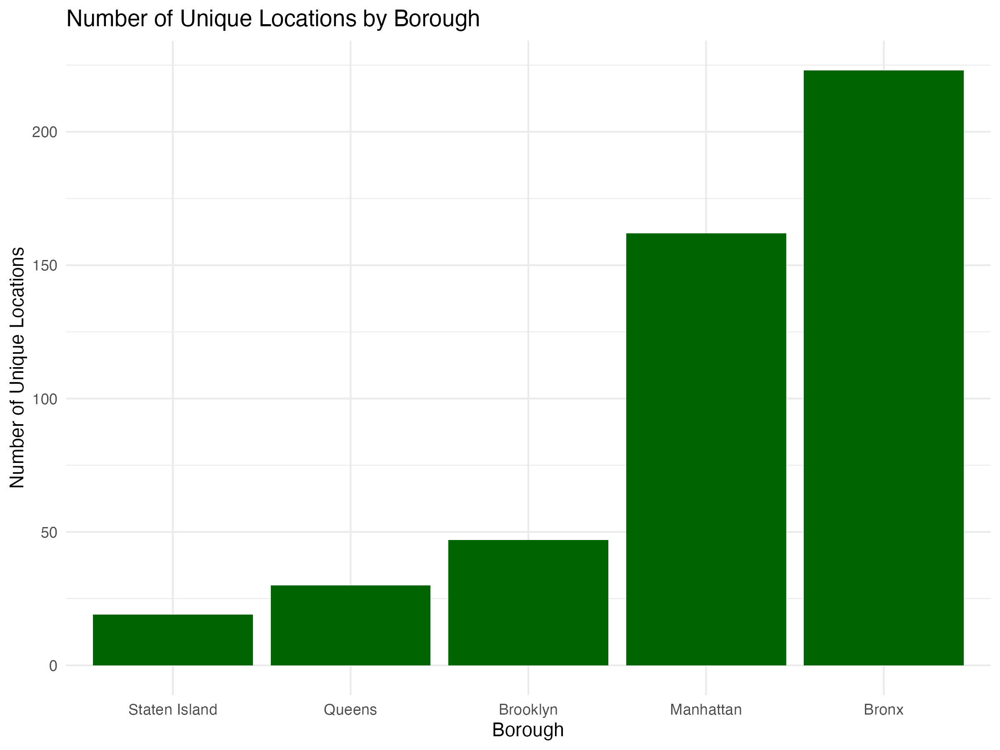
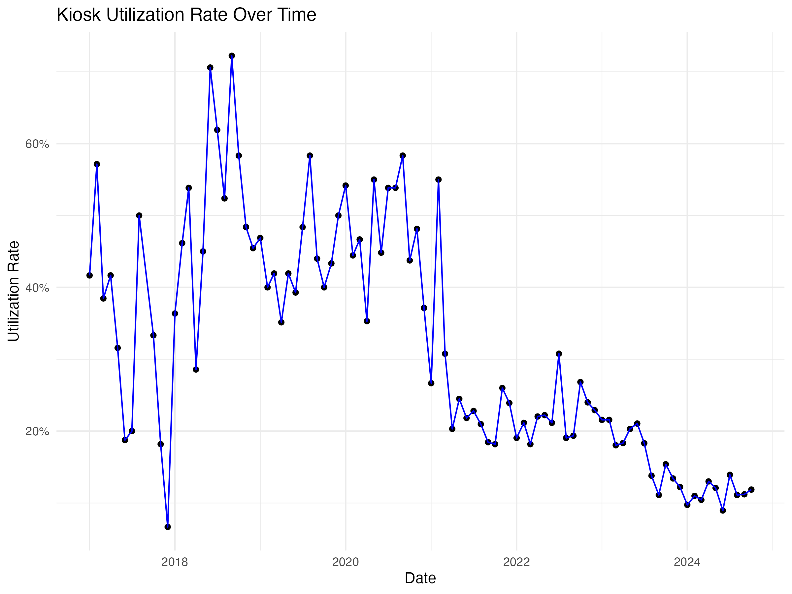
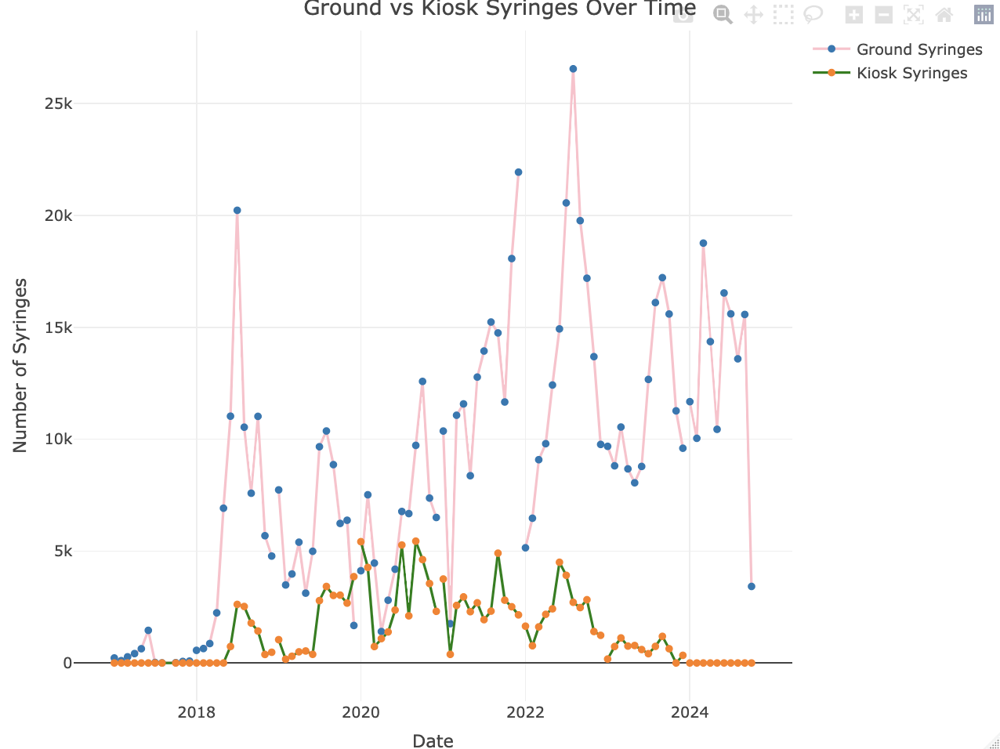

```{css echo = FALSE}
.center {
  width: 75%;
  display: block;
  margin-left: auto;
  margin-right: auto;
}

.column3 {
  float: left;
  width: 33.33%;
  padding: 5px;
}

.column2 {
  float: left;
  width: 50%;
  padding: 5px;
}

.column2, .column3 p{
  text-align: center;
  font-weight: bold;
  text-decoration: underline;
}

/* Clear floats after image containers */
.row::after {
  content: "";
  clear: both;
  display: table;
}
```

## Motivation

Public parks play a vital role in urban life, offering spaces for recreation, relaxation, and community engagement. However, their value can be compromised by issues like crime, inadequate cleanliness, and poor sanitation. Our project, _Behind the Green: Data Insights Into NYC Parks’ Cleanliness and Safety_, aims to analyze key factors affecting park visitors’ experiences, including crime rates, restroom conditions, cleanliness, and syringe litter. By uncovering insights through data analysis, we hope to guide improvements and ensure NYC parks remain safe, clean, and welcoming for all.

## Related Work

For the crime in NYC parks, 

About the sanitation aspect, we firstly analyze the [cleanliness of NYC parks](cleanliness.html), identifying specific features contributing to lower cleanliness scores, as well as examining temporal and spatial variations. This allows us to pinpoint key factors behind the fluctuations in cleanliness levels and formulate strategies for improvements. Second, understanding and improving the condition of restrooms is crucial as clean [restrooms](restroom.html) play a significant role in promoting public health and comfort, encouraging greater park use. Lastly, the critical issue of [syringe litter](syringe.html), which poses serious health and safety concerns, especially in public areas where children and families gather, demands systematic investigation. Our study aims to gather insights into the extent of this issue to support informed, data-driven decision-making and interventions.

## Initial Questions

- [**Crime**](crime.html): What is the trend of different crime types over the years in NYC parks? How do crime patterns vary across different boroughs of NYC parks? Is there a pattern of crime types in parks with a higher number of crimes?  
- [**Cleanliness**](cleanliness.html): What are the cleanliness ratings by different features? How do cleanliness ratings vary over different time periods? What is the relationship between cleanliness and park categories?  
- [**Restroom**](restroom.html): What is the distribution of restroom sanitation conditions in New York City’s public parks? How do sanitation conditions vary by borough and park type? What is the trend in restroom sanitation ratings across different seasons and years (2015-2024)?  
- [**Syringe**](syringe.html): How does syringe litter differ between parks? How does utilization of safe disposal kiosks change over time? How does utilization of safe disposal kiosks compare with syringe litter?

## Data
**Data Source**  

- [**Crime**](crime.html):The park crime data comes from [NYC Park Crime Statistics](https://www.nyc.gov/site/nypd/stats/crime-statistics/park-crime-stats.page) provided by NYPD. This dataset contains detailed records of reported crimes in New York City's parks. It includes data on various crime types, such as robbery, assault, and larceny, categorized by park, borough, and time period. This dataset is updated quarterly and aims to enhance public safety by offering transparency on crime trends in recreational areas. It serves as a valuable resource for researchers, policymakers, and residents interested in understanding and addressing crime in NYC parks.  
- [**Cleanliness**](cleanliness.html): The Cleanliness data comes from the Parks Inspection Program (PIP), which evaluates New York City parks through regular inspections. PIP assesses the cleanliness of parks across 17 features, categorized under cleanliness, structural, and landscape conditions. Each feature is rated either as "Acceptable" (A) or "Unacceptable" (U), providing insight into the cleanliness conditions across different locations and features.   Datasets on properties and cleanliness are maintained in this part.  
- [**Restroom**](restroom.html): Restroom data is also gathered through PIP and records detailed information about public restroom inspections in New York City parks. These inspections rate the restroom facilities for cleanliness and structural quality, contributing to the overall evaluation of park facilities. This dataset allows for the analysis of restroom conditions across different parks and helps to identify potential areas for improvement.  
- [**Syringe**](syringe.html): The Syringe dataset records syringe collection in NYC Parks, gathered by NYC Parks staff and various organizations under the Syringe Litter Data Collection initiative. The data highlights syringe disposal patterns and is accessible via NYC OpenData. The syringe collection data provides valuable insights into the safety and public health conditions of NYC Parks and is compiled monthly after thorough quality checks.  

**Data Cleaning**  

- [**Crime**](crime.html):The data processing process involves several steps to import, clean, and filter crime data from various park crime files spanning from 2015 to 2024. Since crime data is stored quarterly, we wrote a function to traverse all data file paths and special files were handled individually. The final dataset includes variables:  

  - `park`: park names;  
  - `borough`: parks' boroughs;  
  - `size_acres`: size in acres;  
  - `category`: categories of parks;  
  - Crime types: `murder`, `rape`, `robbery`, `felony_assault`, `burglary`, `grand_larceny`, `grand_larceny_of_motor_vehicles`;  
  - `total`: total crimes happened in that park;  
  - `year`: statistical year;  
  - `season`: statistical season.
  
Each row is a crime record for a park in specific year and season.  

- [**Cleanliness**](cleanliness.html): Multiple datasets were loaded and cleaned to ensure consistent column names. Key features, including Litter, Glass, Graffiti, Weeds, and Ice, were selected for analysis. The datasets were merged using `prop_id` and `inspection_id`, resulting in a comprehensive dataset with park information, feature ratings, and cleanliness inspection data. The dataset was then further cleaned by handling missing values, removing unnecessary columns, and standardizing string values to maintain consistency. The final dataset includes variables:

  - `prop_num`: Unique identification number for each park property.  
  - `prop_name`: Name of park property.  
  - `prop_id`: Unique identification number for a property or portion of a property.  
  - `site_name`: Name of park property or portion of a property.  
  - `boro`: Borough in which property is located.  
  - `zip_code`: Zip Code in which the property is located.  
  - `category`: Property rating category for Parks Inspection Program.  
  - `feature`: Property feature assigned a rating.  
  - `rating`: Feature rating.  
  - `inspection_id`: Inspection ID associated with feature.  
  - `feature_number`: Unique feature identification number.  
  - `season`: Inspection season of inspection.  
  - `date`: Date of inspection.  
  - `inspection_year`: Inspection year of inspection.  
  - `cleanliness`: Cleanliness rating.  

- [**Restroom**](restroom.html): Three datasets (toilet_inspection, parks_inspection, and sites_inspection) were imported and standardized for consistency. They were merged based on common identifiers (inspection_id and prop_id). New features, such as the year column, were added, and unnecessary columns were removed. The data was filtered to focus on public restrooms and relevant attributes. Missing values in key columns were addressed, and categorical values like season and borough were standardized. The dataset was then filtered to include records from 2015 to 2024, ensuring a clean and consistent dataset for analysis. The final dataset includes variables:

  - `park_id`: A unique identifier for the park.  
  - `park_name`: The name of the park.  
  - `category`: The category of the park.  
  - `boro`: The borough in which the park is located.  
  - `year`: The year of the data record.  
  - `season`: The season during which the data was recorded.  
  - `round`: The inspection round.  
  - `prop_location`: The specific location or address of the park.  
  - `visitor_count`: The number of visitors to the park.  
  - `pr_litter`: The litter condition rating for the public restrooms.  

- [**Syringe**](syringe.html): The dataset on syringe findings in NYC parks was cleaned through several steps. Date-time information was standardized by converting the `collected_date` field to a consistent format and extracting the year. Month names were also standardized to their abbreviated format. Missing values in syringe counts and kiosk numbers were replaced with zeros for consistency. Duplicate entries were removed, and records with invalid location values were filtered out. Additionally, the `kiosk_site` field was updated to TRUE where `kiosk_syringes` > 0, ensuring locations with recorded kiosk usage were properly flagged. The final dataset includes variables:

  - `location`: The name of the park where syringes were collected.  
  - `borough`: Borough in which syringe collection took place.    
  - `property_type`: Describes the location of syringe collection as park, zone, or playground.    
  - `kiosk_site`: Marks the location where syringes were collected as a site with a kiosk or not.   
  - `kiosk_numbe`r: The identification number assigned to a kiosk.   
  - `ground_syringes`: The number of syringes collected off the ground.   
  - `kiosk_syringes`: The number of syringes collected from kiosks.   
  - `total_syringes`: The total number of syringes collected.   
  - `year`: The year syringes were collected.   
  - `month`: The month syringes were collected.   
  - `month_text`: The month syringes were collected in text format.  


## Exploratory Analysis

### 1. Crime in NYC Parks

**Crime Counts by Year in NYC Parks**


The plot shows that serious crimes like grand larceny of motor vehicles, murder, rape, and robbery maintain a relatively stable trend, while burglary, felony assault, and grand larceny (excluding motor vehicles) exhibit some fluctuations. Burglary and robbery declined in 2020, likely due to COVID-19 restrictions, whereas felony assault shows a potential rise, possibly influenced by sparse crowds and fewer witnesses, which may embolden offenders.

**Crime Proportion in NYC Parks**


The pie chart reveals that grand larceny (41.1%), robbery (31%), and felony assault (22%) are the most common crime types in parks over the past decade. Property crimes like grand larceny and robbery dominate, likely due to the ease of committing such offenses in less monitored park areas. Felony assault is less frequent, possibly due to underreporting or a law enforcement focus on non-violent crimes in parks. Violent crimes such as murder and rape are rare, reflecting their low overall frequency and the impact of deterrent measures or enforcement efforts. Similarly, the low rate of grand larceny of motor vehicles in parks may result from effective security measures and targeted policing.

**Heatmap of Crime Counts in NYC Parks (by Year and Borough)**


The heatmap shows total crimes across NYC boroughs by year, with darker red indicating higher crime rates. Manhattan stands out with consistently high crime, driven by its dense population, economic activity, and attractions. Brooklyn follows due to similar factors, while the Bronx’s moderate crime levels may reflect socioeconomic challenges. Queens’ residential nature and diversity align with its lower rates, and Staten Island’s minimal crime totals suggest its suburban character and differing law enforcement focus. Over the years, crime patterns remain stable, with minor variations possibly linked to policy or socio-economic changes.

**Distribution of Crime Counts by Type in Top 3 Parks**


The plot shows no murders (thus deleted in the plot) and few felonies in the three parks, with most crimes being less severe. Grand larceny is the most common, particularly in Flushing Meadows-Corona Park and Washington Square Park, due to high foot traffic and valuables. Robbery and felony assault are also notable in Flushing Meadows-Corona Park, possibly due to its size and diverse spaces. Burglary and grand larceny of motor vehicles are rare and mainly occur in Flushing Meadows-Corona Park, likely linked to limited structures and extensive parking. Violent crimes like rape are minimal, aligning with broader trends of low violent crime in public spaces. These patterns reflect park-specific factors such as size, usage, and monitoring.

### 2. Sanitation Conditions of NYC Parks

#### 2.1 Overall Cleanliness

**The proportions of three rating types for different features**  

From the bar chart below, we can observe the proportions of three rating types — Unacceptable (U), Very Unacceptable (U/S), and their combined proportion (U + U/S) — for different features (Glass, Graffiti, Ice, Litter, and Weeds).


- For all features, the proportion of "U/S" is relatively low compared to the "U" rating, suggesting that while some features may have been rated very unacceptable, the majority of issues fall into the unacceptable category without additional safety concerns.  
- `Litter`: The feature "Litter" has the highest combined (U + U/S) and individual "U" proportions compared to all other features. This indicates that litter is the most problematic feature in terms of cleanliness, frequently being rated as unacceptable.  
- `Weeds`: Weeds have relatively high values for both "U" and "U + U/S" proportions. This suggests that weeds are also a significant cleanliness issue.  
- `Graffiti`: Graffiti shows a moderate level of unacceptable ratings (both "U" and "U + U/S"), indicating that it is frequently, but not as consistently as Litter, rated as problematic.  
- `Glass` and `Ice`: Both features have relatively low proportions across all rating types, suggesting that these features are generally well-maintained and less frequently rated as unacceptable.  

**The least error-prone feature in different boroughs**


The table shows the feature in each borough with the highest proportion of "A" cleanliness ratings, indicating which features are the least error-prone in terms of cleanliness for each borough. The data includes results for five boroughs: Brooklyn (B), Manhattan (M), Queens (Q), Staten Island (R), and Bronx (X).

Ice is the best-maintained feature in Brooklyn, Manhattan, Queens, and Bronx, with "A" rating proportions ranging from 97.91% to 98.85%. This indicates consistent cleanliness management across these boroughs. In Staten Island, Glass has the highest "A" rating at 98.87%, suggesting a different focus in cleanliness efforts. Overall, Ice appears to be easier to maintain across multiple boroughs, while Glass is notably well-managed in Staten Island.  

**The cleanliness ratings of NYC and its boroughs during the decade**  

We calculated and compared the overall “A” rating proportion of cleanliness in each borough and the whole New York City each year, and analyzed the cleanliness trend in different boroughs.  

  

- **Overall Trend**: The overall Acceptable proportion for New York City (grey line) shows a steady increase from around 90% in 2015 to 93% by 2018, followed by a significant decline around 2020, with a slight recovery in 2022.  
- **Inter-Borough**: `Staten Island` and `Queens` show significantly higher cleanliness levels compared to other boroughs, whereas the `Bronx` and `Brooklyn` display noticeably lower cleanliness in certain years.  
- The `Bronx` exhibits large fluctuations in cleanliness, with a sharp decline in 2022 to below 87%, marking it as the borough with the lowest cleanliness proportion. `Manhattan` shows a steady increase from 92% in 2015, peaking in 2018, with slight fluctuations but maintaining relatively high cleanliness levels. `Brooklyn` sees an improvement after 2017, a notable dip around 2020, and a recovery to above 90% by 2022.  
- `Staten Island` consistently maintains an Acceptable proportion above 96%, making it the most stable and cleanest borough throughout the period. `Queens` starts with a high cleanliness proportion in 2015, rising significantly after 2018 to nearly 97%, and remains one of the leading boroughs despite a slight decline.  
- The decline around 2020 could be attributed to pandemic-related resource shortages and increased maintenance challenges.  

**Analysis of cleanliness and park category**  
 Then, we studied the association between park types and cleanliness and analyzed which park types were more likely to accumulate litter.
 
 
 
- It can be found that the proportion of "N" ratings is small but slightly higher in categories like Large Park and Other, suggesting some missing or incomplete cleanliness data in these types of parks.  
- The proportion of "A" ratings is consistently high across all park categories, almost reaching 100%. This indicates that most parks received an acceptable cleanliness rating.  
- The proportion of "U" ratings is relatively low, with noticeable increases in the `Large Park` and `Small Park` categories. Specifically, `Large Park` shows a higher percentage of "U" ratings.  
- Other categories, such as `Greenstreet`, `Large Center`, and `Small Center`, show almost no "U" ratings, with proportions close to 0%.  

#### 2.2 Restroom Sanitation

**Distribution of Restroom Sanitation Conditions**

We analyzed the distribution of restroom sanitation ratings, with categories “Acceptable (A),” “Unacceptable (U),” “Not Rated (N),” and “Very Unacceptable (U/S).” 


The majority (78.7%) of restrooms are rated as “Acceptable,” while 18.9% remain “Not Rated.” Only small percentages are classified as “Unacceptable” (1.37%) or “Very Unacceptable” (1.06%).

**Restroom Sanitation by Borough and Park Type**

Next, we examined how sanitation conditions vary by borough and park type (category).

```{=html}
<div class="row">
  <div class="column2">
    
  </div>
  <div class="column2">
    
  </div>
</div>
```

By borough, the Bronx has the highest percentage of “Acceptable” restrooms (84.3%), followed by Queens (80.8%). Other boroughs report similar low percentages for “Unacceptable” and “Very Unacceptable.” By park type, Restrooms in both large and small parks are mostly rated as “Acceptable” (79.1% and 78.5%, respectively). Small parks have slightly higher “Not Rated” percentages (19.2%) compared to large parks (18%), but “Unacceptable” and “Very Unacceptable” ratings are consistently low across both types.

**Trends in Restroom Sanitation Ratings by Season-Year**


Seasonal trends show that restroom sanitation is generally better in summer and fall, with “Acceptable” ratings reaching 80%-90%. Winter sees a drop to 75%-80%, possibly due to weather-related maintenance challenges, while spring ratings improve as weather warms.

**Visitor Count and Restroom Sanitation**

We examined the relationship between restroom sanitation and visitor counts.


Restrooms with higher visitor counts are more likely to have lower ratings, especially “Very Unacceptable” conditions, emphasizing the need for focused maintenance in high-traffic areas.


#### 2.3 Syringe Litter Issue

**Top 10 Locations with the Highest Average Annual Increase in Syringe Findings**




We found that Aqueduct Walk and St. Mary's Park show significantly higher rates of increase, with approximately 4,000 and 3,500 additional syringes per year respectively. These two parks require immediate attention to address the growing syringe litter issue.

**Total Syringe Distribution**


The total syringes distribution shows a heavily skewed distribution, with a significant number of parks having a very low number of syringes, and a small number of parks having a very high number of syringes.

The data provides important insights into the scale and distribution of this public health and safety concern, which can help policymakers and local authorities determine where to focus their efforts and resources to address the problem of improper syringe disposal in NYC's green spaces.

**Seasonal Trends in Syringe Findings**

```{=html}
<div class="row">
  <div class="column2">
    
  </div>
  <div class="column2">
    
  </div>
</div>
```

The monthly syringe findings from 2017 to 2024 reveal a clear increasing trend over the years, with 2022 showing the highest peak of nearly 30,000 syringes in July. The data demonstrates consistent seasonal patterns, with higher counts typically occurring during summer months (June-September) and lower counts in winter months. Recent years (2021-2024) show notably higher syringe counts compared to earlier years (2017-2019), suggesting an intensifying challenge in urban park maintenance and public health management.

**Syringe Findings by Property Type and Borough**

```{=html}
<div class="row">
  <div class="column2">
    
  </div>
  <div class="column2">
    
  </div>
</div>
```

For the boroughs, the graph shows that the Bronx leads with over 200 unique locations, followed by Manhattan with approximately 160 locations, indicating that this issue is more prevalent in these two boroughs compared to others like Brooklyn, Queens, and Staten Island.

For the property types, traditional parks (PARK) dominate with approximately 400 unique locations, while other property types - Greenstreets (GREENST), Playgrounds (PLGD), and Zones (ZONE) - each report far fewer locations, around 40-50 sites each. This pattern suggests that syringe-related issues are predominantly concentrated in standard park areas rather than specialized recreational spaces.

**Kiosk Utilization over Time**



The kiosk utilization rate demonstrates a pronounced downward trend from 2018 to 2024. During the early period (2017-2020), utilization fluctuated considerably between 40-70%, with peak rates reaching around 70%. A significant decline occurred post-2021, with rates steadily dropping to approximately 10-15% by 2024. This substantial decrease suggests a concerning trend in the effectiveness or acceptance of the kiosk disposal program over time, particularly in recent years.

**Ground Findings vs. Kiosk Findings over Time**



This plot compares ground-found and kiosk-collected syringes from 2017 to 2024, revealing a stark contrast between collection methods. Ground syringes (shown in blue) demonstrate high variability and an overall increasing trend, with peaks reaching over 25,000 in 2022. In contrast, kiosk collections (shown in green) remain consistently lower, rarely exceeding 5,000 syringes, and show a declining trend toward zero by 2024. This disparity suggests that despite the implementation of kiosk disposal programs, ground collection remains the predominant method of syringe recovery in NYC parks. 

## Discussion

The analysis of NYC parks reveals several critical insights. 

For [**Crime**](crime.html) in NYC parks, the analysis is subject to several limitations. The dataset, based on reported crimes, may underrepresent actual crime occurrences due to underreporting, particularly in lower socioeconomic boroughs, potentially skewing the findings. Additionally, the analysis lacks predictive insights or an exploration of causative factors, limiting its utility for proactive crime prevention measures. While visualizations provide helpful overviews, some, such as heatmaps, aggregate data at the borough level, which can oversimplify trends and mask intra-borough or park-specific variations. These limitations reduce the depth and effectiveness of the analysis in understanding crime patterns and informing future strategies.

Regarding [**Cleanliness**](cleanliness.html), certain features, seasons, and boroughs were identified as factors that influence cleanliness levels. Features such as graffiti and litter consistently showed lower cleanliness scores, with cleanliness ratings varying seasonally, generally better in winter. Borough-level differences indicate the need for targeted interventions in areas lagging behind. These results align with our expectations and emphasize the importance of feature-specific solutions and seasonal adjustments.

For [**Restroom**](restroom.html) conditions, the findings show a disparity across boroughs, with Brooklyn and Manhattan often reporting higher rates of unacceptable conditions. The data also suggest that higher visitor counts, particularly during spring and summer, lead to a decline in sanitation. Although many restrooms maintain acceptable conditions, a notable number still fall under "Unacceptable" or "Very Unacceptable" categories, highlighting areas that require improvement.

In terms of [**Syringe**](syringe.html) litter, the analysis points out that traditional parks are the primary locations for syringe findings, significantly outnumbering other property types like Greenstreets and Playgrounds. The Bronx and Manhattan have the highest number of affected locations, and the peak findings during summer suggest seasonal trends that need attention. Regression analysis reveals the need for revising harm reduction strategies, focusing on more effective interventions in high-risk areas, particularly given the reduced utilization of kiosks and increasing ground findings. Addressing these issues requires further research into environmental factors and targeted policy adjustments.
