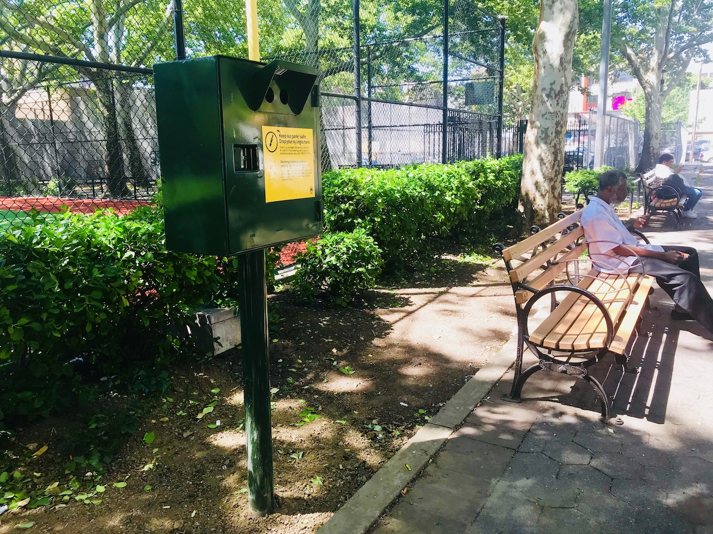

## Motivation
The critical issue of syringe litter in New York City parks was vividly highlighted in a recent YouTube video["Used syringes, needles litter one of the Bronx's largest parks"](https://www.youtube.com/watch?v=E_udp3ewgf0), which documented the disturbing presence of discarded needles in one of the borough's major recreational spaces. This visual evidence of the problem resonated with growing community concerns about public safety and health risks in urban parks, particularly in areas where children and families gather. While this coverage brought public attention to the issue, there remains a critical need for systematic, data-driven analysis of syringe litter patterns across NYC parks to inform evidence-based interventions and policy decisions.

<div style="text-align: center;">
{width=80%}

</div>

## Initial questions

- How does syringe litter differ between parks?  
- How does utilization of safe disposal kiosks change over time?  
- How does utilization of safe disposal kiosks compare with syringe litter?  

## Data processing

### Initial Data File
This dataset contains records of syringe collection in New York City's Parks, gathered jointly by NYC Parks staff and partner organizations including [Washington Heights Corner Project](https://www.nycservice.org/organizations/index.php?org_id=1462) and [New York Harm Reduction Educators](https://nyhre.org/). The dataset is part of NYC Parks Syringe Litter Data Collection initiative and is publicly accessible through the [NYC OpenData](https://data.cityofnewyork.us/Public-Safety/Summary-of-Syringe-Data-in-NYC-Parks/t8xi-d5wb/about_data) ([Map data](https://data.cityofnewyork.us/Public-Safety/Parks-Syringe-Disposal-Kiosks-Map/dpfn-5ihn)), demonstrating the city's commitment to transparency in public health and safety data. Daily collection data is compiled and published monthly after thorough quality control processes, making it a reliable source for analyzing syringe disposal patterns in NYC Parks.

<div style="text-align: center;">
{width=80%}
</div>

```{r setup, include=FALSE}
# load necessary libraries
library(tidyverse)
library(dplyr)
library(ggplot2)
library(patchwork)
library(gtsummary)
library(sf)
library(tmap)
library(leaflet)
library(leaflet.extras)
library(plotly)
library(knitr)
library(broom)
library(car)
```

### Data cleaning
```{r}
syringe_df <- read_csv("data/nycparks_syringe/Summary_of_Syringe_Data_in_NYC_Parks_20241125.csv") %>% 
  mutate(
    collected_date = mdy_hms(collected_date),
    year = year(collected_date),
    month_text = factor(month_text, levels = month.abb),
    ground_syringes = ifelse(is.na(ground_syringes), 0, ground_syringes),
    kiosk_syringes = ifelse(is.na(kiosk_syringes), 0, kiosk_syringes),
    total_syringes = ifelse(is.na(total_syringes), 0, total_syringes),
    kiosk_number = ifelse(is.na(kiosk_number), 0, kiosk_number ),
    kiosk_site = ifelse(kiosk_syringes > 0, TRUE, kiosk_site)) %>%
  distinct() %>%
  filter(location != "0") %>% 
  select(-c(response_id, gispropnum, omppropid, created_date, precinct, source, kiosk_type, collected_date, time_of_day, group, district, week)) %>% 
  relocate(location, everything())
```

The dataset on syringe findings in NYC parks was processed through several key cleaning steps. First, we standardized the date-time information by converting the collected_date field to a consistent format and extracting the year component. We also standardized the month names using the abbreviated format. Missing values in syringe counts (`ground_syringes`, `kiosk_syringes`, `total_syringes`) and `kiosk_numbers` were replaced with zeros to ensure consistent numerical analysis. Duplicate entries were removed using distinct(), and records with invalid location values (where location = "0") were filtered out. Especially, we updated `kiosk_site` to TRUE where `kiosk_syringes` > 0, this ensures locations with recorded kiosk usage are properly flagged.

The variables we kept in the dataset are:  
- `location`: The name of the park where syringes were collected.  
- `borough`: Borough in which syringe collection took place.    
- `property_type`: Describes the location of syringe collection as park, zone, or playground.    
- `kiosk_site`: Marks the location where syringes were collected as a site with a kiosk or not.   
- `kiosk_numbe`r: The identification number assigned to a kiosk.   
- `ground_syringes`: The number of syringes collected off the ground.   
- `kiosk_syringes`: The number of syringes collected from kiosks.   
- `total_syringes`: The total number of syringes collected.   
- `year`: The year syringes were collected.   
- `month`: The month syringes were collected: The month syringes were collected.   
- `month_text`: The month syringes were collected in text format.   

## Exploratory Data Analysis

```{r}
location_trends <- syringe_df %>%
  group_by(location, year) %>%
  summarise(
    annual_total = sum(total_syringes)
  ) %>%
  arrange(location, year) %>%
  group_by(location) %>%
  mutate(
    year_change = annual_total - lag(annual_total),
    pct_change = (year_change / lag(annual_total)) * 100
  ) %>%
  filter(!is.na(year_change)) %>%
  summarise(
    avg_annual_change = mean(year_change, na.rm = TRUE),
    total_change = sum(year_change, na.rm = TRUE)
  ) %>%
  arrange(desc(avg_annual_change))

p10 <- ggplot(head(location_trends, 10), 
            aes(x = reorder(location, avg_annual_change), 
                y = avg_annual_change)) +
  geom_bar(stat = "identity", fill = "#69b3a2") +
  coord_flip() +
  theme_minimal() +
  labs(title = "Top 10 Locations by Average Annual Increase in Syringes",
       x = "Location",
       y = "Average Annual Change") +
  theme(
    plot.title = element_text(size = 12),
    axis.text = element_text(size = 10)
  )

ggplotly(p10)
```

Among the top 10 locations with the highest average annual increase in syringe findings, Aqueduct Walk and St. Mary's Park show significantly higher rates of increase, with approximately 4,000 and 3,500 additional syringes per year respectively. St. James Park ranks third with about 2,000 annual increases, while the remaining locations, including Washington Square Park and Poe Park, show more moderate increases of less than 1,000 syringes per year.

Let's see the summary statistics of syringe count columns
```{r}
syringe_df %>% 
  select(c(6:8)) %>%
  tbl_summary()
```

The summary statistics reveal that among 34,867 syringe-related records, the median total syringes found was 10 (IQR: 3-26), while kiosk usage metrics consistently showed zero values, suggesting limited utilization of safe disposal facilities.

```{r}

p1 = ggplot(syringe_df, aes(x = ground_syringes)) +
  geom_histogram(binwidth = 10, fill = "#69b3a2", color = "white", alpha = 0.8) +
  xlim(0, 200) +
  coord_cartesian(ylim = c(0, 8000)) +
  geom_vline(aes(xintercept = mean(ground_syringes, na.rm = TRUE)), 
             color = "red", linetype = "dashed", size = 1) +
  labs(
    subtitle = "within the main range (0-200)",
    x = "Ground Syringes",
    y = "Count"
  ) +
  theme_minimal() +
  theme(
    plot.title = element_text(size = 18, face = "bold"),
    plot.subtitle = element_text(size = 14, face = "italic"),
    axis.title = element_text(size = 14),
    axis.text = element_text(size = 12)
  )

p2 = ggplot(syringe_df, aes(x = kiosk_syringes)) +
  geom_histogram(binwidth = 5, boundary = 0, fill = "#69b3a2", color = "white", alpha = 0.8) +
  xlim(0, 100) +
  coord_cartesian(ylim = c(0, 2000)) +
  geom_vline(aes(xintercept = mean(kiosk_syringes, na.rm = TRUE)), 
             color = "red", linetype = "dashed", size = 1) +
  labs(
    subtitle = "within the main range (0-100)",
    x = "Kiosk Syringes",
    y = "Count"
  ) +
  theme_minimal() +
  theme(
    plot.title = element_text(size = 18, face = "bold"),
    plot.subtitle = element_text(size = 14, face = "italic"),
    axis.title = element_text(size = 14),
    axis.text = element_text(size = 12)
  )

p1 + p2
```

The distribution of syringe findings shows markedly different patterns between ground and kiosk collections. Ground syringes show a highly right-skewed distribution with most counts falling between 0-50 and a median around 10 (indicated by the red dashed line). In contrast, kiosk syringes demonstrate a more concentrated distribution within the 0-25 range, with notably fewer occurrences overall and a median near zero, suggesting limited utilization of disposal facilities.

```{r}
ggplot(syringe_df, aes(x = total_syringes)) +
  geom_histogram(binwidth = 10, fill = "#69b3a2", color = "white", alpha = 0.8) +
  xlim(0, 200) +
  coord_cartesian(ylim = c(0, 10000)) +
  geom_vline(aes(xintercept = mean(ground_syringes, na.rm = TRUE)), 
             color = "red", linetype = "dashed", size = 1) +
  labs(
    title = "Distribution of Total Syringes in NYC Parks",
    subtitle = "within the main range (0-200)",
    x = "Total Syringes",
    y = "Count"
  ) +
  theme_minimal() +
  theme(
    plot.title = element_text(size = 18, face = "bold"),
    plot.subtitle = element_text(size = 14, face = "italic"),
    axis.title = element_text(size = 14),
    axis.text = element_text(size = 12)
  )
```

The total syringes distribution shows a similar pattern to ground syringes, with a right-skewed distribution and a median around 10. 

```{r}
location_count <- syringe_df %>%
  distinct(location) %>%
  nrow()
print(paste("Total number of unique parks:", location_count))

```

We identified 477 unique parks in this dataset, indicating a broad representation of NYC's park system in the syringe collection records.

```{r}
  park_syringe = 
  syringe_df %>% 
  filter(!is.na(kiosk_site)) %>%
  distinct(location, .keep_all = TRUE)

  ggplot(park_syringe, aes(x = factor(kiosk_site), fill = factor(kiosk_site))) +
  geom_bar() +
  theme_minimal() +
  labs(title = "Distribution of Kiosk Sites",
       x = "Kiosk Site",
       y = "Count") +
  scale_fill_discrete(name = "Kiosk Site") +
  theme(
    plot.title = element_text(size = 14, face = "bold"),
    axis.title = element_text(size = 12)
  )
```

Due to the limited utilization of kiosk sites, the distribution of kiosk and non-kiosk locations is highly imbalanced, with a vast majority of syringe collection sites lacking kiosk facilities.

So we want to see the distribution of syringe kiosks, here is the map of syringe kiosks in NYC parks.

```{r}
syringe_map = read_csv("data/nycparks_syringe/Parks_Syringe_Disposal_Kiosks_20241202.csv")

process_data <- function(syringe_map) {
  syringe_map$POINT_lng <- as.numeric(gsub(".*\\((.*) .*\\)", "\\1", syringe_map$Point))
  syringe_map$POINT_lat <- as.numeric(gsub(".*\\(.* (.*)\\)", "\\1", syringe_map$Point))
  return(syringe_map)
}

syringe_map <- process_data(syringe_map)
map <- leaflet(syringe_map) %>%
  addTiles() %>%
  setView(lng = -73.91, lat = 40.83, zoom = 12) %>%
  addCircleMarkers(
    lng = ~POINT_lng,
    lat = ~POINT_lat,
    radius = 8,
    color = ~case_when(
      KioskType == "Indoor Wall Mount" ~ "blue",
      KioskType == "Outdoor Post Mount" ~ "green",
      KioskType == "Outdoor Wall Mount" ~ "red",
      TRUE ~ "gray"
    ),
    fillOpacity = 0.7,
    stroke = FALSE,
    popup = ~paste(
      "<b>Location:</b>", Location, "<br>",
      "<b>Park:</b>", PropertyName, "<br>",
      "<b>Type:</b>", KioskType, "<br>",
      "<b>Status:</b>", Status, "<br>",
      "<b>Container Size:</b>", ContainerSize
    )
  ) %>%
  addLegend(
    position = "bottomright",
    colors = c("blue", "green", "red"),
    labels = c("Indoor Wall Mount", "Outdoor Post Mount", "Outdoor Wall Mount"),
    title = "Kiosk Types",
    opacity = 0.7
  ) %>%
  addSearchOSM() %>%
  addMeasure()

map

```

The map provides a visual representation of syringe kiosk locations in NYC parks, with distinct markers indicating different kiosk types and statuses. The interactive features allow users to explore individual kiosk details and container sizes, providing valuable insights into the distribution and accessibility of safe disposal facilities across the city.

Next, we will explore the temporal trends in syringe findings and kiosk utilization rates to identify patterns and potential correlations between these metrics.

```{r}
yearly_monthly_trends <- syringe_df %>%
  group_by(year, month) %>%
  summarise(total_syringes = sum(total_syringes)) %>%
  ungroup()

p3 <- ggplot(yearly_monthly_trends, aes(x = factor(month), y = total_syringes, 
                                       group = 1,
                                       text = paste("Year:", year,
                                                  "<br>Month:", month,
                                                  "<br>Syringes:", total_syringes))) +
  geom_line() +
  geom_point() +
  facet_wrap(~year, scales = "free_y", ncol = 2) +
  theme_minimal() +
  labs(title = "Monthly Syringe Findings Trends (2017-2024)",
       x = "Month",
       y = "Number of Syringes Found") +
  theme(
    plot.title = element_text(size = 14, face = "bold"),
    axis.text.x = element_text(angle = 45, hjust = 1),
    strip.text = element_text(size = 12, face = "bold")
  ) +
  scale_x_discrete(labels = month.abb)

interactive_faceted <- ggplotly(p3, tooltip = "text")

p4 <- ggplot(yearly_monthly_trends, 
             aes(x = factor(month), 
                 y = total_syringes, 
                 color = factor(year), 
                 group = year,
                 text = paste("Year:", year,
                            "<br>Month:", month,
                            "<br>Syringes:", total_syringes))) +
  geom_line(size = 1) +
  geom_point() +
  theme_minimal() +
  labs(title = "Combined Monthly Syringe Findings Trends (2017-2024)",
       x = "Month",
       y = "Number of Syringes Found",
       color = "Year") +
  theme(
    plot.title = element_text(size = 14, face = "bold"),
    axis.text.x = element_text(angle = 45, hjust = 1),
    legend.position = "right"
  ) +
  scale_x_discrete(labels = month.abb)

combined_plot <- ggplotly(p4, tooltip = "text")

interactive_faceted
combined_plot

yearly_monthly_trends %>%
  group_by(year) %>%
  summarise(
    total_syringes = sum(total_syringes),
    avg_monthly = mean(total_syringes),
    max_monthly = max(total_syringes),
    min_monthly = min(total_syringes)
  ) %>% 
  knitr::kable()

```


```{r}
monthly_trend <- syringe_df %>%
  group_by(month, month_text) %>%
  summarise(
    total_syringes = sum(total_syringes)
  )


all_monthly <- ggplot(monthly_trend, aes(x = month_text, y = total_syringes, group = 1)) +
  geom_line(color = "#69b3a2") +
  geom_point(color = "red") +
  theme_minimal() +
  labs(title = "Monthly syringe discovery trends", 
       x = "Month", 
       y = "syringe count") +
  theme(axis.text.x = element_text(angle = 45, hjust = 1))  # Rotate x-axis labels

 ggplotly(all_monthly)

```

The monthly syringe findings from 2017 to 2024 reveal a clear increasing trend over the years, with 2022 showing the highest peak of nearly 30,000 syringes in July. The data demonstrates consistent seasonal patterns, with higher counts typically occurring during summer months (June-September) and lower counts in winter months. Recent years (2021-2024) show notably higher syringe counts compared to earlier years (2017-2019), suggesting an intensifying challenge in urban park maintenance and public health management.

```{r}
borough_summary <- syringe_df %>%
  group_by(borough) %>%
  summarise(
    unique_locations = n_distinct(location),
    total_syringes = sum(total_syringes),
    avg_syringes_per_location = total_syringes/unique_locations
  )

p5 <- ggplot(borough_summary, 
             aes(x = reorder(borough, unique_locations), 
                 y = unique_locations,
                 text = paste("Borough:", borough,
                            "<br>Unique Locations:", unique_locations,
                            "<br>Total Syringes:", total_syringes,
                            "<br>Avg per Location:", round(avg_syringes_per_location, 2)))) +
  geom_bar(stat = "identity", fill = "darkgreen") +
  theme_minimal() +
  labs(title = "Number of Unique Locations by Borough",
       x = "Borough",
       y = "Number of Unique Locations")

ggplotly(p5, tooltip = "text")
```

The distribution of unique locations with syringe findings varies substantially across NYC boroughs. The Bronx leads with over 200 unique locations, followed by Manhattan with approximately 160 locations. Brooklyn shows a moderate number with about 45 locations, while Queens and Staten Island report significantly fewer sites, with around 25 and 15 locations respectively. This geographic pattern suggests a concentration of syringe-related issues in the northern boroughs of the city.

```{r}
property_summary <- syringe_df %>%
  group_by(property_type) %>%
  summarise(
    unique_locations = n_distinct(location),
    total_syringes = sum(total_syringes),
    avg_syringes_per_location = total_syringes/unique_locations
  )

p6 <- ggplot(property_summary, 
             aes(x = reorder(property_type, unique_locations), 
                 y = unique_locations,
                 text = paste("Property Type:", property_type,
                            "<br>Unique Locations:", unique_locations,
                            "<br>Total Syringes:", total_syringes,
                            "<br>Avg per Location:", round(avg_syringes_per_location, 2)))) +
  geom_bar(stat = "identity", fill = "lightgreen") +
  theme_minimal() +
  coord_flip() +
  labs(title = "Number of Unique Locations by Property Type",
       x = "Property Type",
       y = "Number of Unique Locations")

ggplotly(p6, tooltip = "text")
```

The distribution of unique locations with syringe findings varies significantly across different property types. Traditional parks (PARK) dominate with approximately 400 unique locations, while other property types - Greenstreets (GREENST), Playgrounds (PLGD), and Zones (ZONE) - each report far fewer locations, around 40-50 sites each. This pattern suggests that syringe-related issues are predominantly concentrated in standard park areas rather than specialized recreational spaces.

```{r}
monthly_kiosk_trend <- syringe_df %>%
  group_by(year, month) %>%
  summarise(
    total_locations = n_distinct(location),
    kiosk_locations = n_distinct(location[kiosk_site == TRUE]),
    total_syringes = sum(total_syringes),
    kiosk_utilization_rate = kiosk_locations / total_locations
  ) %>%
  mutate(date = as.Date(paste(year, month, "01", sep = "-")))

p7 <- ggplot(monthly_kiosk_trend, 
             aes(x = date, 
                 y = kiosk_utilization_rate,
                 group = 1,
                 text = paste("Date:", format(date, "%Y-%m"),
                            "<br>Utilization Rate:", round(kiosk_utilization_rate * 100, 2), "%",
                            "<br>Kiosk Locations:", kiosk_locations,
                            "<br>Total Locations:", total_locations))) +
  geom_point() +
  geom_line(color = "blue") +
  theme_minimal() +
  labs(title = "Kiosk Utilization Rate Over Time",
       x = "Date",
       y = "Utilization Rate") +
  scale_y_continuous(labels = scales::percent)

ggplotly(p7, tooltip = "text")
```

The kiosk utilization rate demonstrates a pronounced downward trend from 2018 to 2024. During the early period (2017-2020), utilization fluctuated considerably between 40-70%, with peak rates reaching around 70%. A significant decline occurred post-2021, with rates steadily dropping to approximately 10-15% by 2024. This substantial decrease suggests a concerning trend in the effectiveness or acceptance of the kiosk disposal program over time, particularly in recent years.


```{r}
monthly_comparison <- syringe_df %>%
  group_by(year, month) %>%
  summarise(
    total_locations = n_distinct(location),
    kiosk_locations = n_distinct(location[kiosk_site == TRUE]),
    total_syringes = sum(total_syringes),
    ground_syringes = sum(ground_syringes),
    kiosk_syringes = sum(kiosk_syringes)
  ) %>%
  mutate(
    date = as.Date(paste(year, month, "01", sep = "-")),
    kiosk_rate = kiosk_locations / total_locations
  ) %>%
  arrange(date)

p8 <- plot_ly() %>%
  add_trace(
    data = monthly_comparison,
    x = ~date,
    y = ~ground_syringes,
    name = "Ground Syringes",
    type = "scatter",
    mode = "lines+markers",
    line = list(color = "pink")
  ) %>%
  add_trace(
    data = monthly_comparison,
    x = ~date,
    y = ~kiosk_syringes,
    name = "Kiosk Syringes",
    type = "scatter",
    mode = "lines+markers",
    line = list(color = "green")
  ) %>%
  layout(
    title = "Ground vs Kiosk Syringes Over Time",
    xaxis = list(title = "Date"),
    yaxis = list(title = "Number of Syringes"),
    hovermode = "x unified"
  )
p8
```

This plot compares ground-found and kiosk-collected syringes from 2017 to 2024, revealing a stark contrast between collection methods. Ground syringes (shown in blue) demonstrate high variability and an overall increasing trend, with peaks reaching over 25,000 in 2022. In contrast, kiosk collections (shown in green) remain consistently lower, rarely exceeding 5,000 syringes, and show a declining trend toward zero by 2024. This disparity suggests that despite the implementation of kiosk disposal programs, ground collection remains the predominant method of syringe recovery in NYC parks. 

```{r}
location_comparison <- syringe_df %>%
  group_by(location) %>%
  summarise(
    has_kiosk = any(kiosk_site == TRUE, na.rm = TRUE),
    total_syringes = sum(total_syringes),
    ground_syringes = sum(ground_syringes),
    kiosk_syringes = sum(kiosk_syringes),
    avg_syringes_per_report = mean(total_syringes)
  )

p9 <- ggplot(location_comparison, 
            aes(x = factor(has_kiosk, 
                          labels = c("No Kiosk", "Has Kiosk")), 
                y = total_syringes,
                fill = factor(has_kiosk))) +
  geom_boxplot(alpha = 0.7,
               outlier.shape = 21,
               outlier.color = "black",
               outlier.fill = "white",
               outlier.size = 3) +
  theme_minimal() +
  labs(title = "Syringe Distribution by Kiosk Presence",
       subtitle = "Comparison of total syringes found at locations with and without kiosks",
       x = "",
       y = "Total Syringes Found") +
  scale_fill_manual(values = c("#FF9999", "#99CC99")) +
  theme(
    plot.title = element_text(size = 16, face = "bold", margin = margin(b = 10)),
    plot.subtitle = element_text(size = 12, color = "grey40", margin = margin(b = 20)),
    axis.title.y = element_text(size = 12, margin = margin(r = 10)),
    axis.text = element_text(size = 11),
    legend.position = "none",
    panel.grid.major.x = element_blank(),
    panel.grid.minor = element_blank(),
    panel.border = element_rect(color = "grey90", fill = NA)
  ) +
  scale_y_continuous(labels = scales::comma)

ggplotly(p9, tooltip = c("y", "x")) %>%
  layout(hoverlabel = list(bgcolor = "white"))

```

The boxplot reveals a stark contrast in syringe distribution by kiosk presence, but the majority of parks do not have kiosks installed. While locations with kiosks show higher syringe counts and greater variability (with outliers reaching 300,000), this may reflect a strategic placement of kiosks in areas already known to have higher syringe activity rather than indicating kiosk effectiveness. The compressed distribution for "No Kiosk" locations represents a much larger number of parks, most of which experience lower syringe counts.

### Additional questions——Predictive modeling

We also want to explore the relationship between syringe counts and other factors including `property_type`, `borough`,`year`, `month` and `kiosk_site`. To do this, we built a linear regression model to predict syringe counts based on these variables and evaluate the model's performance.

```{r}
model_data <- syringe_df %>%
  group_by(location, year, month, property_type, borough, kiosk_site) %>%
  summarise(
    total_syringes = sum(total_syringes),
    has_kiosk = any(kiosk_site == TRUE, na.rm = TRUE)
  ) %>%
  ungroup()

model <- lm(total_syringes ~ property_type + has_kiosk + borough + month + year, 
                    data = model_data)

model_data$predicted <- predict(model)

p11 = ggplot(model_data, aes(x = predicted, y = total_syringes, color = borough)) +
  geom_point(alpha = 0.6) +
  geom_abline(intercept = 0, slope = 1, linetype = "dashed") +
  theme_minimal() +
  labs(title = "Actual vs Predicted Syringe Counts",
       x = "Predicted Count",
       y = "Actual Count") +
  scale_x_continuous(labels = scales::comma) +
  scale_y_continuous(labels = scales::comma)

  ggplotly(p11)
```

The scatter plot of actual versus predicted syringe counts reveals considerable variation in model performance across different boroughs. While there is a positive correlation between predicted and actual counts (indicated by the dashed line), the model appears to underpredict high syringe counts, particularly in the Bronx and Manhattan where several points fall well above the prediction line. Manhattan shows the highest concentration of points at higher predicted values, while Staten Island and Queens cluster at lower predicted counts. The model's predictions range from -500 to about 1,000 syringes, with actual counts reaching up to 10,000, suggesting limitations in capturing extreme cases.


```{r}
par(mfrow=c(2,2))
plot(model)
```

The diagnostic plots reveal several concerns with the our model's assumptions. The Residuals vs Fitted plot shows a clear pattern with increasing variance at higher fitted values, indicating heteroscedasticity. The Q-Q plot demonstrates significant deviation from normality, particularly in the upper tail, suggesting the presence of outliers. The Scale-Location plot confirms non-constant variance across fitted values, while the Residuals vs Leverage plot identifies several influential observations (points 1972, 1968, and 129). These diagnostics suggest that model transformations or alternative modeling approaches may be needed to better meet regression assumptions.

## Discussion
The analysis reveals that syringe findings are predominantly concentrated in traditional PARK locations, which account for approximately 400 Parks, significantly outnumbering other property types such as Greenstreets, Playgrounds, and Zones (each with around 40-50 locations). Geographically, the Bronx leads with over 200 unique locations, followed by Manhattan with approximately 160 sites, while other boroughs like Brooklyn, Queens, and Staten Island show considerably fewer affected areas. Monthly trends indicate higher syringe counts during summer months, with peak findings reaching over 25,000 in mid-2022, suggesting both temporal and spatial patterns in distribution that warrant targeted intervention strategies.

Our analysis of NYC parks' syringe data reveals concerning trends: a sharp decline in kiosk utilization (from 70% to 10-15%) despite increasing ground findings, and significant geographic disparities with the Bronx and Manhattan showing the highest concentrations. Traditional parks face the greatest challenges. 

The regression model highlights the complexity of factors influencing syringe distribution, though its predictive power is limited for extreme cases. These findings suggest the need for a revised harm reduction strategy, focusing on targeted interventions in high-risk areas and reevaluation of the kiosk program's implementation. The model diagnostics reveal heteroscedasticity and non-normality, particularly in high-volume locations, suggesting that the relationship between environmental factors and syringe findings is more complex than initially assumed. Future research should explore additional variables and modeling techniques to improve predictive accuracy and inform evidence-based policy decisions.
